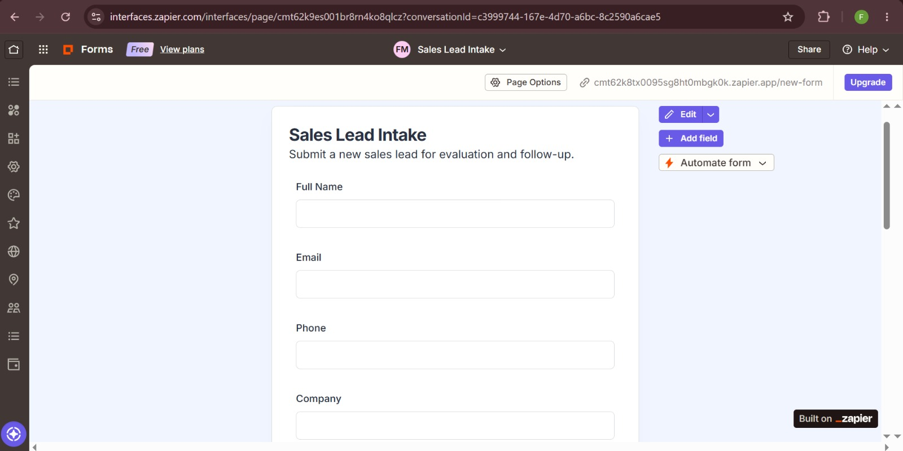
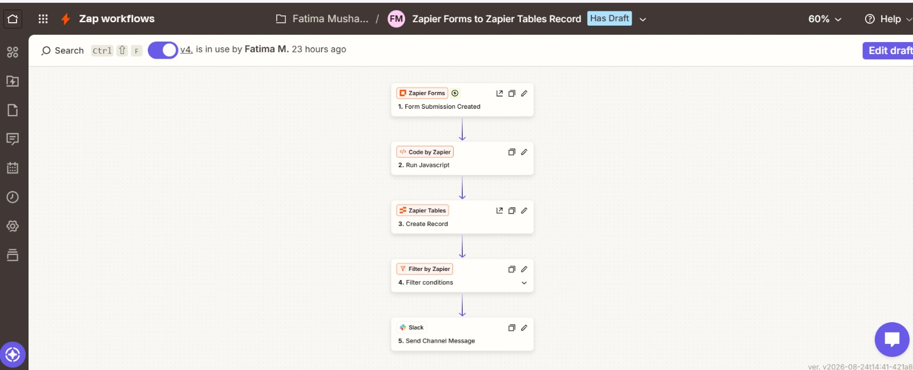
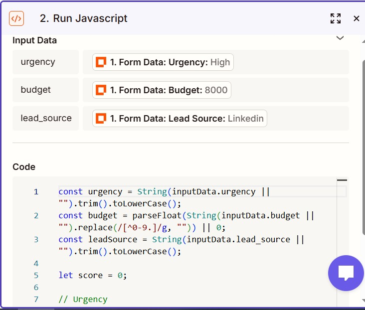
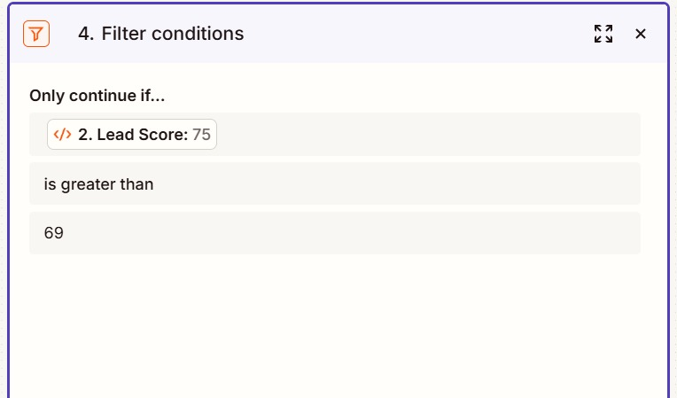
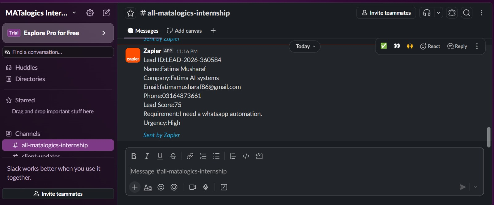

# Task 01 — Lead Intake System

## Task Description

Build a simple lead-capture system for a sales team using Zapier Interfaces,
Zapier Forms, Zapier Tables, and automation.

The system captures lead information, calculates a lead score,
generates a unique Lead ID, stores the lead in Zapier Tables,
and sends a Slack notification when the lead is high priority.

## Tools Used

- Zapier Interfaces
- Zapier Forms
- Zapier Tables
- Code by Zapier
- Filter by Zapier
- Slack

## 1. Interface

Created an Interface page named:

Sales Lead Intake

The interface contains a lead submission form.

### Form Fields

- Full Name
- Email
- Phone
- Company
- Industry
- Budget
- Lead Source
- Requirement
- Urgency

### Lead Source Options

- Website
- LinkedIn
- Instagram
- Referral
- Advertisement

### Urgency Options

- Low
- Medium
- High

## 2. Zapier Table

Created a Zapier Table named:

Leads

### Columns

- Lead ID
- Name
- Email
- Phone
- Company
- Industry
- Budget
- Lead Source
- Requirement
- Urgency
- Lead Score
- Status
- Created At

Default Status:

New

## 3. Automation Workflow

The automation works as follows:

Sales Lead Intake Form
→ Form Submission Trigger
→ Code by Zapier
→ Calculate Lead Score
→ Generate Lead ID
→ Create Record in Zapier Tables
→ Filter High-Priority Leads
→ Send Slack Notification

## 4. Lead Scoring

### Urgency

- High = +30
- Medium = +20
- Low = +10

### Budget

- Above $5,000 = +30
- $1,000–$5,000 = +20
- Below $1,000 = +10

### Lead Source

- Referral = +20
- LinkedIn = +15

### Priority

- 70+ = Hot
- 40–69 = Warm
- Below 40 = Cold

## 5. Test Input

Example test submission:

| Field | Value |
|---|---|
| Name | Fatima Musharaf |
| Company | ABC Company |
| Industry | Restaurant |
| Budget | $8,000 |
| Lead Source | LinkedIn |
| Urgency | High |
| Requirement | AI-powered customer ordering system |

## 6. Test Output

The system calculated:

- Lead Score: 75
- Priority: Hot
- Status: New
- Lead ID: Generated automatically
- Created At: Generated automatically

### Score Calculation

High urgency = +30

Budget above $5,000 = +30

LinkedIn = +15

Total = 75

Since 75 is greater than 69, the lead passes the high-priority filter.

## 7. Slack Notification

When the lead score is 70 or higher, the Filter allows the lead to continue to Slack.

The sales team receives a notification containing important lead information.

## 8. Code

The lead-scoring JavaScript used in Code by Zapier is available here:

[lead-scoring.js](code/lead-scoring.js)

## 9. Result

The completed automation captures leads through the Sales Lead Intake form,
calculates their priority, stores the complete lead in Zapier Tables,
and notifies the sales team about high-priority leads through Slack.